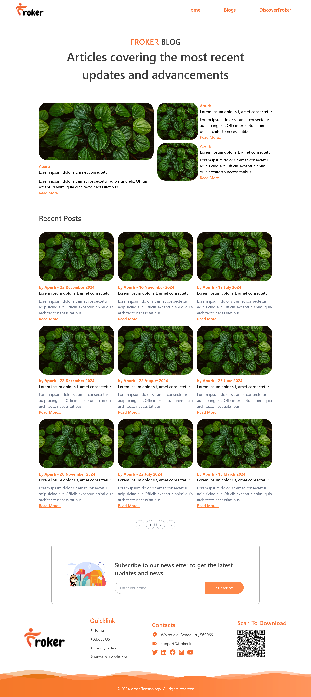

# Blog API Documentation

> [!WARNING]
> Backend is hosted in a free URL be kind with it. Cause API calls are slow due to the free server. If you face any problems try running it locally.

## URLs
- Frontend: [https://forker-theta.vercel.app](https://forker-ajo1.vercel.app/)
- Backend API: [https://forker-ldzq.onrender.com](https://forker-ldzq.onrender.com)

## Screenshots

Here are some screenshots of the application:


*Caption for Screenshot 1*


*Caption for Screenshot 2*

## Getting Started
To start the backend:
```
yarn start
```
To start the frontend:
```
yarn dev
```

## API Endpoints

### 1. Get Recent Posts
- **Endpoint:** `/recent-posts`
- **Method:** GET
- **Query Parameters:** None
- **Description:** Retrieves the 9 most recent blog posts.

### 2. Get Popular Posts
- **Endpoint:** `/popular-posts`
- **Method:** GET
- **Query Parameters:** None
- **Description:** Retrieves the 9 most liked blog posts.

### 3. Get Specific Blog Post
- **Endpoint:** `/blog-page`
- **Method:** GET
- **Query Parameters:**
  - `blogNumber` (required): The unique number of the blog post
- **Description:** Retrieves details of a specific blog post.

### 4. Get Paginated Blog Posts
- **Endpoint:** `/blogs/pagination`
- **Method:** GET
- **Query Parameters:**
  - `page` (optional): The page number (default: 1)
  - `limit` (optional): Number of posts per page (default: 1, recommended: 9)
- **Description:** Retrieves a paginated list of blog posts.

### 5. Update Like Status
- **Endpoint:** `/liked`
- **Method:** GET
- **Query Parameters:**
  - `blogNumber` (required): The unique number of the blog post
  - `like` (required): Boolean value ('true' to like, 'false' to unlike)
- **Description:** Updates the like count of a specific blog post.

## Notes
- All endpoints return a JSON response with a `success` boolean and either a `data` object or an `error` message.
- The `/blogs/pagination` endpoint also returns `currentPage` and `totalPages` in the response.
- Error responses include appropriate HTTP status codes (400 for bad requests, 404 for not found, 500 for server errors).
